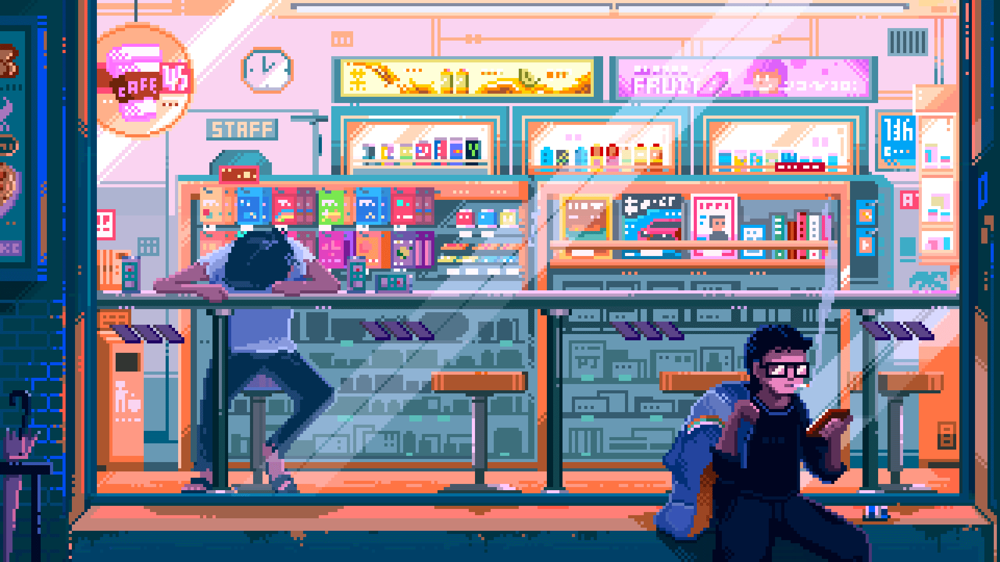

<h1 align="center">Hi 👋, I'm Ananta</h1>

###
===

🚀 Web Developer | 📱 Android Developer | 🔧 IoT Enthusiast

###

<h4 align="left">🛠️ Languages and Tools</h4>

###

###

  
  
  
  
  
  
  
  
  
  
  
  
  
  
  
  
  
  
  
  
  
  
  
  
  
  
  

###

<h4 align="left">🧰 Toolbox I Use</h4>

###

  
  
  
  
  
  
  
  
  
  
  
  
  
  
  

###

  
  
  

###

<picture>
<!-- Crop GIF jadi tipis, tanpa mengecilkan -->

</picture>

###

<h4 align="left">📫 Let's Connect!</h4>

###

  
  
  

###

  

###
